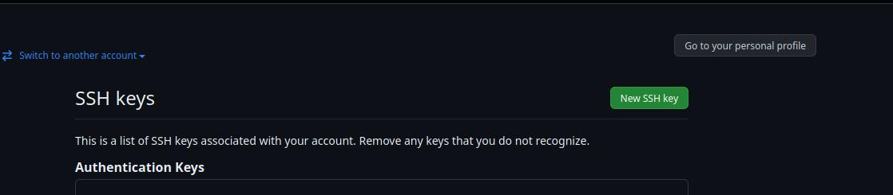
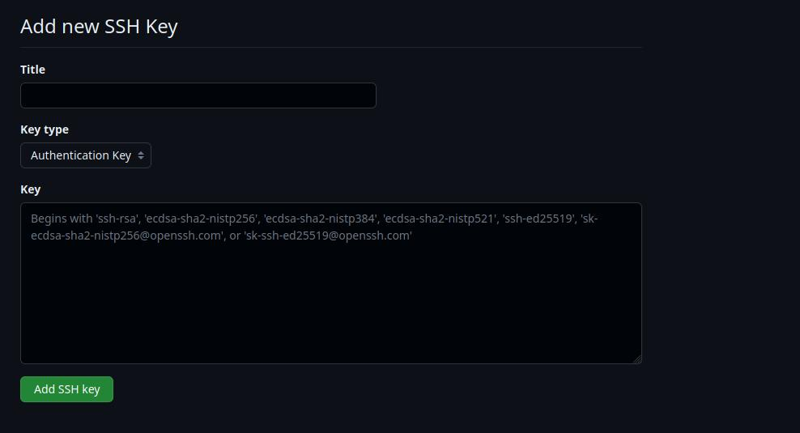

# GitHub Authentication - GitHub SSH Keys (Authentication Key)

- [Set up SSH keys](https://github.com/lbrealdev/le-git/blob/master/github-auth/git_ssh_key.md#set-up-ssh-keys)
- [Add SSH key in GitHub account - Authentication Key](https://github.com/lbrealdev/le-git/blob/master/github-auth/git_ssh_key.md#add-ssh-key-in-github-account---authentication-key)

## Set up SSH keys

Generating a new SSH key:
```shell
ssh-keygen -t ed25519 -C "your_email@example.com"
```
**NOTE:** You can press enter for all prompts or configure it your way.

Add private key to the authentication agent:
```shell
ssh-add
```
**NOTE:** This step is a reference to that point in the [github documentation](https://docs.github.com/en/authentication/connecting-to-github-with-ssh/generating-a-new-ssh-key-and-adding-it-to-the-ssh-agent#adding-your-ssh-key-to-the-ssh-agent).

Check your `~/.ssh` directory:
```shell
ls -lthr ~/.ssh
```

You should see these two files:
```txt
id_ed25519.pub
id_ed25519
```

The `id_ed25519.pub` is your public key, this is the key that must be defined in your **[Github Settings / SSH and GPG keys](https://github.com/settings/keys)**.

The `id_ed25519` is your private key, once generated, you should not take any action on it, just keep it safe.

## Add SSH key in GitHub account - Authentication Key

Once the new SSH keys are generated, you can add them to your Github account in the following ways:

- [Web Broser](https://docs.github.com/en/authentication/connecting-to-github-with-ssh/adding-a-new-ssh-key-to-your-github-account?tool=webui)
- [GitHub CLI](https://docs.github.com/en/authentication/connecting-to-github-with-ssh/adding-a-new-ssh-key-to-your-github-account?tool=cli)

### Using GitHub web browser

Go to [SSH and GPG keys](https://github.com/settings/keys) in Github Settings panel:





Within the Keys panel, click in [New SSH key](https://github.com/settings/ssh/new) to create a new key:





- In the `Title` field add a name for your SSH key, I recommend something similar to this:

>
>      Github SSH Auth Key
>

- In the `Key Type` field, select `Authentication Key`, which is the default value.

- In the `Key` field, add the value of `~/.ssh/id_ed25519.pub`, which is something like this:

Run:
```shell
cat ~/.ssh/id_ed25519.pub
```

Public key output example:
```txt
ssh-ed25519 XXXXX your_email@example.com
```

**NOTE:** In the `Key` field we always put the value of the public key, it's something a little confusing, but it's well documented.

### Using GitHub CLI

- [GitHub CLI guide](https://github.com/lbrealdev/le-git/tree/master/github-cli)

**After adding a new SSH authentication key to your account on GitHub.com, you can reconfigure any local repositories to use SSH**. For more information, see [Managing remote repositories](https://docs.github.com/en/get-started/getting-started-with-git/managing-remote-repositories#switching-remote-urls-from-https-to-ssh).


Source:

- [GitHub Authentication - SSH](https://docs.github.com/en/authentication/connecting-to-github-with-ssh/about-ssh)
