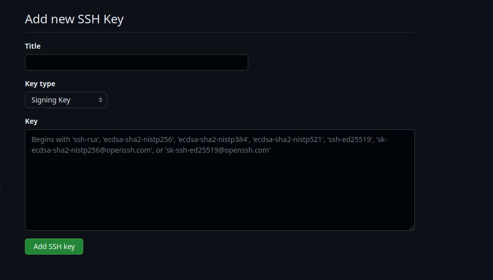
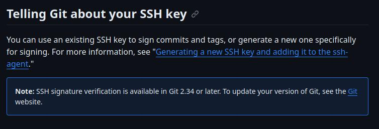
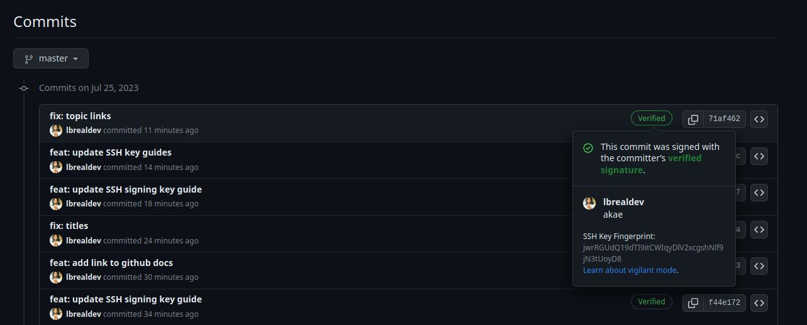
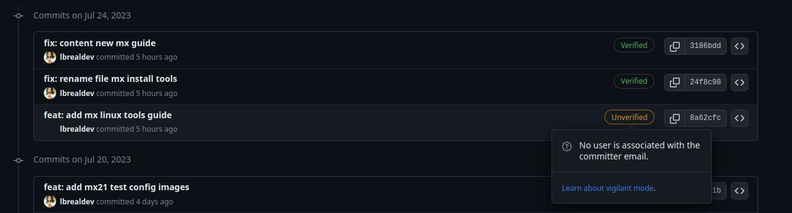

# GitHub Authentication - GitHub SSH Keys (Signing Key)

<!-- TOC -->

- [Set up SSH keys](https://github.com/lbrealdev/le-git/blob/master/github-auth/git_ssh_signing_key.md#set-up-ssh-keys)
- [Add SSH key in GitHub account - Signing Key](https://github.com/lbrealdev/le-git/blob/master/github-auth/git_ssh_signing_key.md#add-ssh-key-in-github-account---signing-key)
- [Commit Signature Verification](https://github.com/lbrealdev/le-git/blob/master/github-auth/git_ssh_signing_key.md#commit-signature-verification)

**NOTE:** If you came from the [GitHub SSH Keys (Authentication Key)](https://github.com/lbrealdev/le-git/blob/master/github-auth/git_ssh_key.md) guide, proceed from the following step.

- [Add SSH key in GitHub Account - Signing Key](https://github.com/lbrealdev/le-git/blob/master/github-auth/git_ssh_signing_key.md#add-ssh-key-in-github-account---signing-key)

**NOTE:** *You can use your SSH key generated in the previous tutorial to sign commits.*

## Set up SSH keys

Generating a new SSH key:
```shell
ssh-keygen -t ed25519 -C "your_email@example.com"
```
**NOTE:** You can press enter for all prompts or configure it your way.

Add private key to the authentication agent:
```shell
ssh-add
```
**NOTE:** This step is a reference to that point in the [github documentation](https://docs.github.com/en/authentication/connecting-to-github-with-ssh/generating-a-new-ssh-key-and-adding-it-to-the-ssh-agent#adding-your-ssh-key-to-the-ssh-agent).

Check your `~/.ssh` directory:
```shell
ls -lthr ~/.ssh
```

You should see these two files:
```txt
id_ed25519.pub
id_ed25519
```

The `id_ed25519.pub` is your public key, this is the key that must be defined in your **[Github Settings / SSH and GPG keys](https://github.com/settings/keys)**.

The `id_ed25519` is your private key, once generated, you should not take any action on it, just keep it safe.

## Add SSH key in GitHub account - Signing Key

Once the new SSH keys are generated, you can add them to your Github account in the following ways:

- [Web Broser](https://docs.github.com/en/authentication/connecting-to-github-with-ssh/adding-a-new-ssh-key-to-your-github-account?tool=webui)
- [GitHub CLI](https://docs.github.com/en/authentication/connecting-to-github-with-ssh/adding-a-new-ssh-key-to-your-github-account?tool=cli)

### Using GitHub web browser

Go to [SSH and GPG keys](https://github.com/settings/keys) in Github Settings panel:


Within the Keys panel, click in [New SSH key](https://github.com/settings/ssh/new) to create a new key:





- In the `Title` field add a name for your SSH key, I recommend something similar to this:

>
>      Github SSH Signing Key
>

**NOTE:** This tip is optional, you can put it in the title you want, I just highlight the key type, since **Authetication Key** and **Signing Key** are different things within the Github authentication scopes.

- In the `Key Type` field, select `Signing Key`.

- In the `Key` field, add the value of `~/.ssh/id_ed25519.pub`, which is something like this:

Run:
```shell
cat ~/.ssh/id_ed25519.pub
```

Public key output example:
```txt
ssh-ed25519 XXXXX your_email@example.com
```

**NOTE:** In the `Key` field we always put the value of the public key, it's something a little confusing, but it's well documented.

### Using GitHub CLI

- [GitHub CLI guide](https://github.com/lbrealdev/le-git/tree/master/github-cli)

## Commit Signature Verification

You can sign commits and tags locally, to give other people confidence about the origin of a change you have made. If a commit or tag has a GPG, SSH, or S/MIME signature that is cryptographically verifiable, GitHub marks the commit or tag "Verified" or "Partially verified."

### Telling Git about your SSH key

**This step is related to the following [github documentation](https://docs.github.com/en/authentication/managing-commit-signature-verification/telling-git-about-your-signing-key#telling-git-about-your-ssh-key)**.

Open terminal and run the following commands for setup git sign commit via SSH key:
```shell
git config --global user.name "Your Name"

git config --global user.email "your_email@example.com"

# Configure Git to use SSH to sign commits and tags.
git config --global gpg.format ssh

# To sign all commits by default
git config --global commit.gpgsign true

# To set your SSH signing key in Git.
git config --global user.signingkey ~/.ssh/id_ed25519.pub
```
**NOTE:** Take this into account.



>
>     If you currently have a git version less than 2.34 this 
>     type of commit signature verify (SSH) will not work, you
>     must upgrade to version 2.34 or later.
>

After setting the Git configuration, you can list your defined variables with the following command:
```shell
git config --global --list
```

Git config example output:
```txt
user.name="Your Name"
user.email=your_email@example.com
user.signingkey=/path/to/.ssh/id_ed25519.pub
gpg.format=ssh
```

### Signing commits

**This step is related to the following [github documentation](https://docs.github.com/en/authentication/managing-commit-signature-verification/signing-commits)**.

You can sign commits locally using GPG, SSH, or S/MIME.

To sign commits, run:
```shell
git add .

git commit -S -m "YOUR_COMMIT_MESSAGE"

# Short command
git commit -a -S -m "YOUR_COMMIT_MESSAGE"
```

You should see the following tag in your web browser commit history:



**NOTE:** It is important that your `user.name` and `user.email` are correctly configured, otherwise you will see the following tag when signing a commit:



GitHub full guides:

- [GitHub Authentication - SSH](https://docs.github.com/en/authentication/connecting-to-github-with-ssh/about-ssh)
- [GitHub Authentication - Commit Signature](https://docs.github.com/en/authentication/managing-commit-signature-verification/about-commit-signature-verification)
- [GitHub Repositories - Branches and Merges](https://docs.github.com/en/repositories/configuring-branches-and-merges-in-your-repository/configuring-pull-request-merges/about-merge-methods-on-github)
